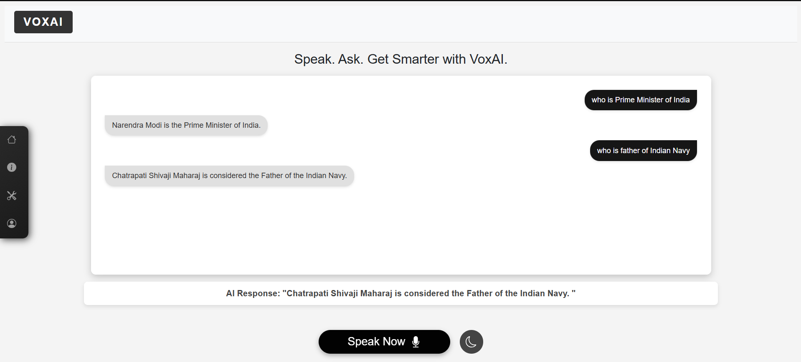

# 🧠 VOXAI – AI-Powered Voice Assistant Web App

VOXAI is a smart, voice-driven assistant web application powered by **Google's Gemini 1.5 Pro**. Built using **Flask**, it offers real-time, concise responses through a conversational interface. The app includes secure user authentication and maintains a history of interactions for a personalized experience.

---

## 🚀 Features

- 🎙️ Voice-based AI assistant using Google Gemini
- 🔐 User registration & secure login system (bcrypt + SQLite)
- 💬 Real-time AI responses with history tracking
- 🌐 Web interface with clean Flask routing
- 🗂️ SQLAlchemy ORM for database interactions

---
## 🖼️ Homepage Preview

---

## 🛠️ Tech Stack

| Category     | Tools/Technologies            |
|--------------|-------------------------------|
| Backend      | Python, Flask, SQLAlchemy     |
| AI Model     | Google Gemini 1.5 Pro         |
| Database     | SQLite                        |
| Security     | bcrypt                        |
| Frontend     | HTML (Jinja2 Templates)       |

---

